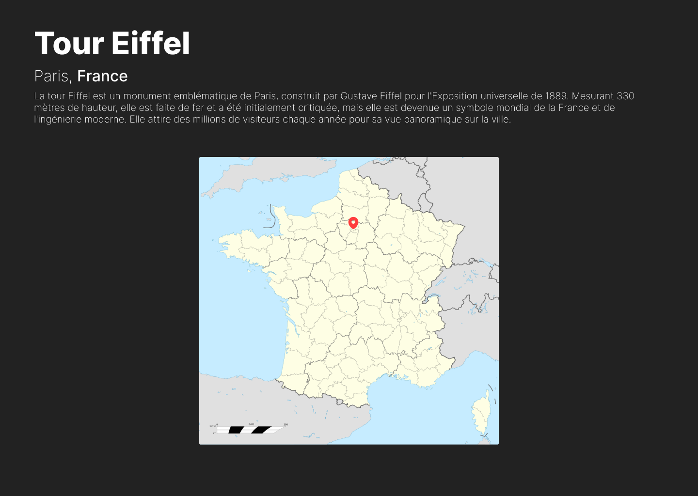

# Les monuments

Afficher des informations sur des monuments lorsque l'utilisateur clique sur un bouton / une image.

## Contexte du projet

Vous venez d'entrer dans une agence web dont l'une des missions consiste à créer un site mettant en valeur les monuments emblématiques de France.

Le client vous met à disposition un jeu de données basique pour commencer le développement, contenant les informations pour 5 monuments ainsi qu'une maquette à respecter.

Vous devez créer un site qui permettra, en un coup d'oeil, de voir les monuments disponibles et d'accéder à des informations sur ces derniers en un clic.
Les seuls informations nécessaires sont : la ville et le pays (dans ce cas, toujours la France) et une courte description du monument.

Le client souhaiterait également afficher une carte de France avec un marqueur qui marquera l'emplacement du monument.

## Modalités pédagogiques

- Activité individuelle en mode collaboratif.
- Vous pouvez modifier l'`index.html`, le `style.css` et bien sûr le `script.js`.
- La couleur noire utilisée dans la maquette est déclarée en tant que custom property dans `style.css` (voir ressources)

### Etape 1 : Création de l'interface utilisateur

- Développez l'interface utilisateur en vous appuyant sur la maquette, avec une liste des monuments en images et une liste de boutons correspondants à chaque monument
- Créez une section vide sous les monuments qui accueillera les informations lorsque l'utilisateur cliquera sur l'un d'entre eux

### Etape 2 : Remplissage de la section informations

- Remplissez la section, pour l'instant vide, avec les informations d'un des monuments pour mettre en forme ces dernières en respectant la maquette

### Etape 3 : Logique de sélection des éléments

- Développez la logique en JS afin de sélectionner un monument en cliquant sur l'image ou sur le bouton associé et de faire apparaître les informations concernant ce monument uniquement
- Création de transitions ou keyframes pour que les informations n'apparaissent pas brutalement (un fondu avec le texte venant de gauche par exemple)

### Etape 4 : Déploiement

- Déployez votre site via Github Pages afin qu'il soit accessible via une URL.

### Bonus : Filtre N/B et Carte avec marqueur

- Filtre noir et blanc appliqué aux autres monuments lorsque l'utilisateur en sélectionne un (voir maquette 2)
- Sous les informations relatives à chaque monument, placez une carte de France `(/images/carte_france.webp)` sur laquelle vous allez indiquer l'emplacement du monument concerné avec un marqueur `(/images/pin.svg)`
Comme ci-dessous :

### Big Bonus : Carte avec marqueur via API publique

- Effectuez des recherches sur des sites qui proposent une API publique que vous pourriez consommer pour afficher une carte interactive (comme openstreetmap) sur laquelle vous pourriez rajouter des marqueurs ou points marquant les différents monuments.
Pour éviter les requêtes trop nombreuses vous pourrez afficher tous les monuments sur une seule carte qui sera toujours affichée.

### Deadline

4 jours

## Modalités d'évaluation

- Correction entre pairs à l'aide d'une grille d'évaluation.

## Livrables

- Un dépôt `GitHub`.
- Le lien de votre site en ligne.

## Critères de performance

- Ajoutez la grille d'évaluation ci-dessous dans le README de la personne que vous corrigez.
- Pensez à compléter le ***nom de la personne corrigée*** et le ***nom du correcteur*** dans l'entête du tableau.
- Indiquez le **nombre d'étoiles obtenues** (l'étoile d'une catégorie est obtenue si tous ses critères de performance sont validés).

| *nom de la personne corrigée*          |                               | *nom du correcteur*       |
| :---- | :----: | :---: |
| Critères de performance                |                               | Remarques du correcteur   |
| ***Interface utilisateur***            |                               |                           |
| - Respect de la maquette               | <ul><li>- [ ] &nbsp;</li><ul> |                           |
| - Interface interactive                | <ul><li>- [ ] &nbsp;</li><ul> |                           |
|                                        | <ul><li>- [ ] ⭐</li><ul>     |                           |
| ***Fonctionnalités***                  |                               |                           |
| - Boutons et clic sur images fonctionnels | <ul><li>- [ ] &nbsp;</li><ul> |                        |
| - Description correspondant au monument sélectionné | <ul><li>- [ ] &nbsp;</li><ul> |              |
| - Transitions sur les informations     | <ul><li>- [ ] &nbsp;</li><ul> |                           |
|                                        | <ul><li>- [ ] ⭐</li><ul>     |                           |
| ***Code***                             |                               |                           |
| - Organisation et lisibilité du code   | <ul><li>- [ ] &nbsp;</li><ul> |                           |
| - Respect des bonnes pratiques HTML/CSS/JS | <ul><li>- [ ] &nbsp;</li><ul> |                       |
| - Commentaires dans le code            | <ul><li>- [ ] &nbsp;</li><ul> |                           |
|                                        | <ul><li>- [ ] ⭐</li><ul>     |                           |
| ***Bonus***                            |                               |                           |
| - Filtre N/B sur les images lors de la sélection | <ul><li>- [ ] &nbsp;</li><ul> |                 |
| - Carte avec marqueurs                 | <ul><li>- [ ] &nbsp;</li><ul> |                           |
|                                        | <ul><li>- [ ] ⭐</li><ul>     |                           |
| ***Big Bonus***                        |                               |                           |
| - Carte avec marqueurs via API         | <ul><li>- [ ] &nbsp;</li><ul> |                           |
|                                        |                               |
| ***Livrables***                        |                               |                           |
| - Projet livré dans les délais         | <ul><li>- [ ] &nbsp;</li><ul> |                           |
|                                        | <ul><li>- [ ] ⭐</li><ul>     |                           |

**Nombre d'étoiles obtenues** : ⭐⭐⭐⭐⭐

## Ressources

- [CSS - Custom Properties](https://developers.google.com/speed/pagespeed/insights/)
- [CSS - Bonus - Not & hover](https://developer.mozilla.org/fr/docs/Web/CSS/--*)

Quelques bases si ce n'est pas déjà acquis :
- [JS - Event Listeners](https://developer.mozilla.org/fr/docs/Web/API/EventTarget/addEventListener)
- [JS - Changer le contenu d'une balise HTML](https://developer.mozilla.org/fr/docs/Learn/JavaScript/Client-side_web_APIs/Manipulating_documents#apprentissage_actif_manipulations_basiques_du_dom)

Pour les informations concernant les monuments, à vous d'effectuer vos recherches (google / wikipedia / chatgpt...).
Les maquettes sont dans le dossier `models`.

## Auteurs

* [Rémy Cottrez](https://github.com/RemyCTRZ)
